# Class Diagram

## Smart Contact Management System — C++ Algorithm Engine Classes

This diagram shows the complete class hierarchy for the C++ DSA engine. Each class implements a specific data structure mapped to a feature in the contact management system.

---

## Full Class Diagram

```mermaid
classDiagram
    class Contact {
        -string id
        -string firstName
        -string lastName
        -string phone
        -string email
        -string company
        -string city
        -string category
        -bool isFavorite
        -bool isBlocked
        -string lastContacted
        -int contactCount
        +Contact()
        +Contact(json data)
        +string getFullName()
        +string getSearchKey()
        +json toJSON()
        +static Contact fromJSON(json data)
        +bool operator<(Contact other)
        +bool operator==(Contact other)
    }

    class TrieNode {
        -map~char, TrieNode*~ children
        -bool isEndOfWord
        -string contactId
        -vector~string~ contactIds
        +TrieNode()
        +~TrieNode()
    }

    class Trie {
        -TrieNode* root
        -int wordCount
        +Trie()
        +~Trie()
        +void insert(string word, string contactId)
        +bool search(string word)
        +vector~string~ autocomplete(string prefix, int limit)
        +vector~string~ prefixSearch(string prefix)
        +bool remove(string word)
        +int getWordCount()
        -void collectWords(TrieNode* node, string prefix, vector~string~ results, int limit)
        -TrieNode* findNode(string prefix)
    }

    class BSTNode {
        -Contact data
        -BSTNode* left
        -BSTNode* right
        -int height
        +BSTNode(Contact contact)
    }

    class BST {
        -BSTNode* root
        -int nodeCount
        +BST()
        +~BST()
        +void insert(Contact contact)
        +Contact* search(string name)
        +bool remove(string name)
        +vector~Contact~ inorderTraversal()
        +vector~Contact~ rangeQuery(string start, string end)
        +Contact* findMin()
        +Contact* findMax()
        +int size()
        -BSTNode* insertNode(BSTNode* node, Contact contact)
        -BSTNode* removeNode(BSTNode* node, string name)
        -BSTNode* findMinNode(BSTNode* node)
        -void inorder(BSTNode* node, vector~Contact~ result)
    }

    class HashMap {
        -int capacity
        -int size
        -float loadFactor
        -vector~list~pair~string, string~~~ table
        +HashMap(int capacity)
        +~HashMap()
        +void insert(string key, string contactId)
        +string find(string key)
        +bool exists(string key)
        +bool remove(string key)
        +vector~pair~string, string~~ findDuplicates(vector~Contact~ contacts)
        +int getSize()
        +float getLoadFactor()
        -int hash(string key)
        -void rehash()
    }

    class Stack {
        -vector~Contact~ data
        -int maxSize
        +Stack(int maxSize)
        +void push(Contact contact)
        +Contact pop()
        +Contact peek()
        +bool isEmpty()
        +int size()
        +vector~Contact~ getAll()
    }

    class Queue {
        -deque~string~ data
        -int maxSize
        +Queue(int maxSize)
        +void enqueue(string query)
        +string dequeue()
        +string front()
        +bool isEmpty()
        +int size()
        +vector~string~ getAll()
    }

    class PriorityQueue {
        -vector~pair~Contact, string~~ heap
        +PriorityQueue()
        +void insert(Contact contact, string priority)
        +Contact extractMax()
        +Contact peekMax()
        +bool isEmpty()
        +int size()
        +vector~Contact~ getTopK(int k)
        -void heapifyUp(int index)
        -void heapifyDown(int index)
        -int parent(int i)
        -int leftChild(int i)
        -int rightChild(int i)
    }

    class MergeSort {
        +static vector~Contact~ sort(vector~Contact~ contacts, string field, string order)
        -static vector~Contact~ merge(vector~Contact~ left, vector~Contact~ right, string field, string order)
        -static bool compare(Contact a, Contact b, string field, string order)
    }

    class QuickSort {
        +static void sort(vector~Contact~ contacts, int low, int high, string field)
        -static int partition(vector~Contact~ contacts, int low, int high, string field)
        -static void swap(Contact a, Contact b)
    }

    class BinarySearch {
        +static int search(vector~Contact~ sortedContacts, string target, string field)
        +static vector~Contact~ rangeSearch(vector~Contact~ sorted, string start, string end, string field)
        -static int lowerBound(vector~Contact~ sorted, string target, string field)
        -static int upperBound(vector~Contact~ sorted, string target, string field)
    }

    class GraphNode {
        -string contactId
        -vector~string~ neighbors
        +GraphNode(string id)
    }

    class Graph {
        -map~string, GraphNode*~ adjacencyList
        -int nodeCount
        -int edgeCount
        +Graph()
        +~Graph()
        +void addNode(string contactId)
        +void addEdge(string id1, string id2)
        +vector~string~ getNeighbors(string contactId)
        +vector~string~ suggestConnections(string contactId, int limit)
        +vector~vector~string~~ findCommunities()
        -vector~string~ bfs(string startId, int depth)
    }

    class ContactEngine {
        -Trie* trie
        -BST* bst
        -HashMap* hashMap
        -Stack* undoStack
        -Queue* searchHistory
        -PriorityQueue* recentQueue
        -Graph* relationGraph
        +ContactEngine()
        +~ContactEngine()
        +void loadContacts(vector~Contact~ contacts)
        +json processCommand(json command)
        +json handleSearch(json params)
        +json handleSort(json params)
        +json handleDuplicates(json params)
        +json handleUndo(json params)
        +json handleHistory(json params)
        +json handleSuggestions(json params)
        +void run()
    }

    Trie *-- TrieNode
    BST *-- BSTNode
    Graph *-- GraphNode
    ContactEngine *-- Trie
    ContactEngine *-- BST
    ContactEngine *-- HashMap
    ContactEngine *-- Stack
    ContactEngine *-- Queue
    ContactEngine *-- PriorityQueue
    ContactEngine *-- Graph
    ContactEngine ..> Contact
    ContactEngine ..> MergeSort
    ContactEngine ..> QuickSort
    ContactEngine ..> BinarySearch
    Stack ..> Contact
    BST ..> Contact
    PriorityQueue ..> Contact
    MergeSort ..> Contact
    QuickSort ..> Contact
    BinarySearch ..> Contact
    HashMap ..> Contact
```

---

## Class Responsibilities

| Class | Data Structure | Feature | Key Operations |
|---|---|---|---|
| `Contact` | Data Model | Core entity representation | Serialization, comparison, JSON conversion |
| `Trie` + `TrieNode` | Trie (Prefix Tree) | Autocomplete & prefix search | Insert O(L), Search O(L), Autocomplete O(L+N) |
| `BST` + `BSTNode` | Binary Search Tree | Alphabetical storage & range queries | Insert O(log N), InOrder O(N), Range O(log N + K) |
| `HashMap` | Hash Table (Chaining) | Duplicate detection by phone/email | Insert O(1), Lookup O(1), Duplicates O(N) |
| `Stack` | Stack (LIFO) | Undo delete operations | Push O(1), Pop O(1) |
| `Queue` | Queue (FIFO) | Search history with fixed size | Enqueue O(1), Dequeue O(1) |
| `PriorityQueue` | Max-Heap | Recently contacted ranking | Insert O(log N), ExtractMax O(log N) |
| `MergeSort` | Merge Sort | Stable alphabetical sorting | Sort O(N log N) — guaranteed |
| `QuickSort` | Quick Sort | Fast numeric sorting | Sort O(N log N) average |
| `BinarySearch` | Binary Search | Search in sorted arrays | Search O(log N) |
| `Graph` + `GraphNode` | Adjacency List Graph | Relationship suggestions | BFS O(V+E), Communities O(V+E) |
| `ContactEngine` | Orchestrator | Main entry point — routes commands to the correct data structure | Processes JSON commands from stdin |

---

## Design Patterns Used

1. **Facade Pattern**: `ContactEngine` provides a single interface to all data structures.
2. **Strategy Pattern**: `MergeSort` and `QuickSort` offer interchangeable sorting strategies via the `field` and `order` parameters.
3. **Composite Pattern**: `Trie` and `BST` use recursive node structures.
4. **RAII**: All dynamically allocated nodes are properly cleaned up in destructors.
