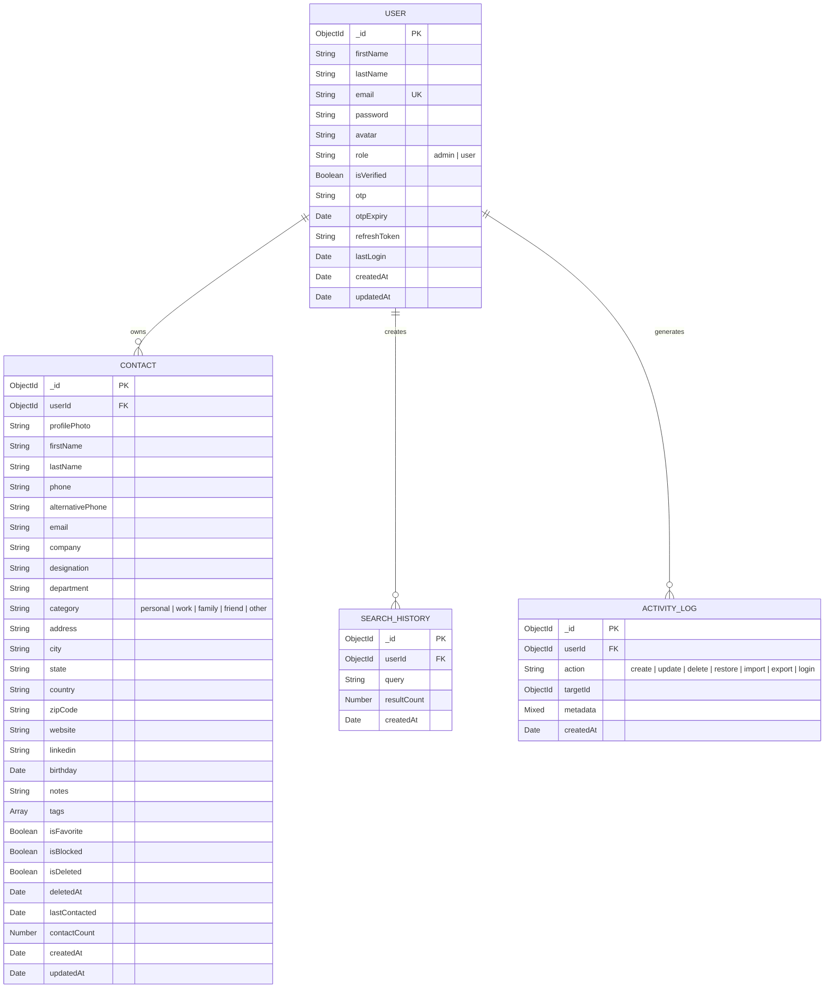

# Entity-Relationship Diagram

## Smart Contact Management System — Database Design

This ER diagram shows the four core MongoDB collections and their relationships.

---

## ER Diagram

---

## Collection Relationships

| Relationship | Type | Description |
|---|---|---|
| User → Contact | One-to-Many | A user owns multiple contacts. Each contact belongs to exactly one user. |
| User → SearchHistory | One-to-Many | Every search query is logged per user. Used by the C++ Queue for FIFO history. |
| User → ActivityLog | One-to-Many | All CRUD and auth actions are logged for analytics and the activity timeline. |

## Indexes

### User Collection
| Index | Fields | Type | Purpose |
|---|---|---|---|
| Email unique | `email` | Unique | Prevent duplicate registrations |

### Contact Collection
| Index | Fields | Type | Purpose |
|---|---|---|---|
| Owner lookup | `userId, isDeleted` | Compound | Fast query for a user's active contacts |
| Full-text search | `firstName, lastName, email, company, phone` | Text | MongoDB fallback text search |
| Favorite filter | `userId, isFavorite` | Compound | Fast favorite listing |
| Company filter | `userId, company` | Compound | Group by company queries |
| City filter | `userId, city` | Compound | Location-based filtering |
| Category filter | `userId, category` | Compound | Category distribution queries |
| Date sort | `userId, createdAt` | Compound | Chronological listing |

### SearchHistory Collection
| Index | Fields | Type | Purpose |
|---|---|---|---|
| User history | `userId, createdAt` | Compound (desc) | Recent searches per user |
| TTL cleanup | `createdAt` | TTL (30 days) | Auto-delete old search history |

### ActivityLog Collection
| Index | Fields | Type | Purpose |
|---|---|---|---|
| User activity | `userId, createdAt` | Compound (desc) | Activity timeline per user |
| TTL cleanup | `createdAt` | TTL (90 days) | Auto-delete old logs |

---

## Design Decisions

1. **Soft Deletes**: Contacts use `isDeleted` + `deletedAt` instead of hard deletes. This enables the undo/restore feature powered by the C++ Stack data structure. A background job permanently removes contacts 30 days after soft deletion.

2. **Denormalized `contactCount`**: Stored directly on the Contact document to avoid expensive aggregation queries when building "most contacted" rankings. Updated atomically with `$inc`.

3. **TTL Indexes**: SearchHistory and ActivityLog use MongoDB TTL indexes for automatic cleanup, preventing unbounded growth.

4. **Text Index**: While the primary search uses the C++ Trie engine, the MongoDB text index serves as a fallback and enables `$text` queries for complex full-text scenarios.
