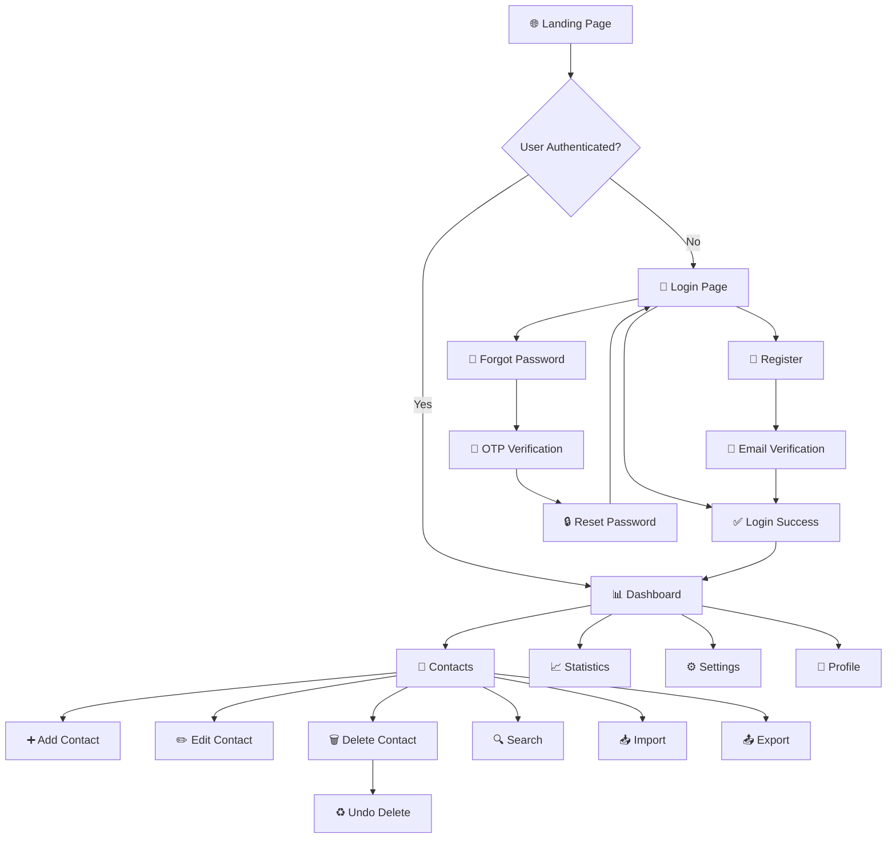
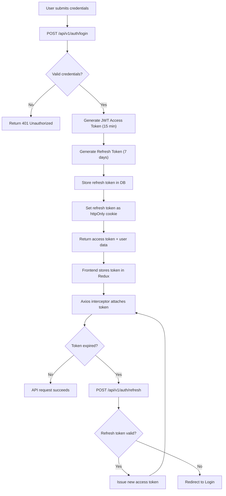
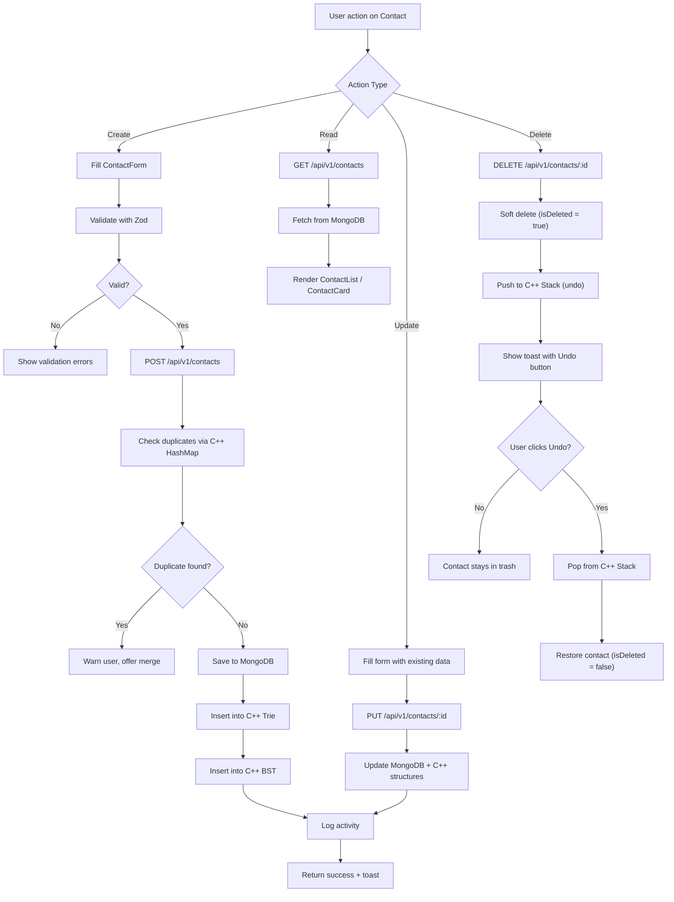
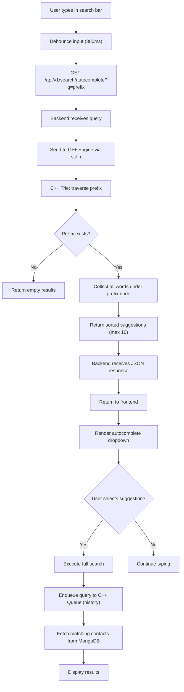
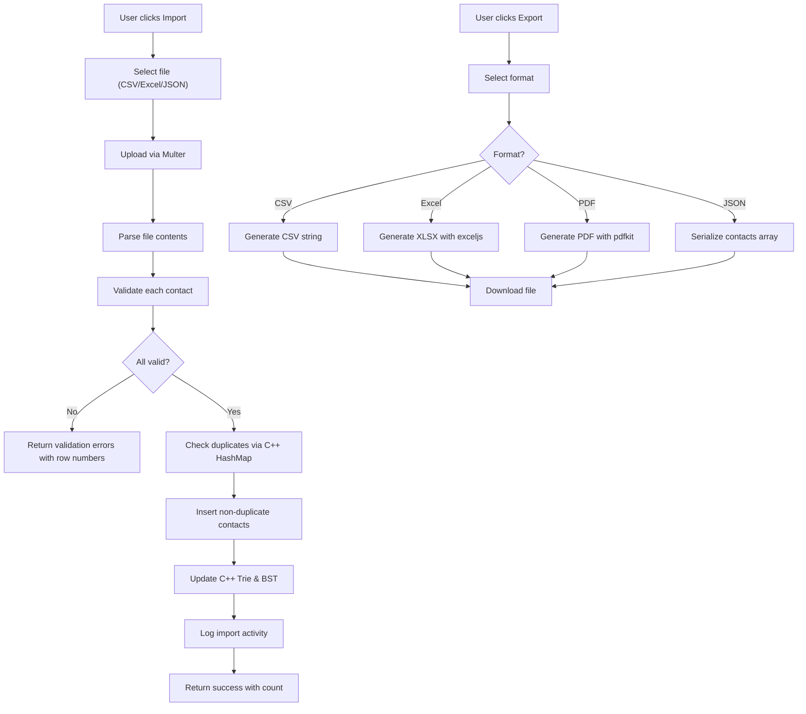
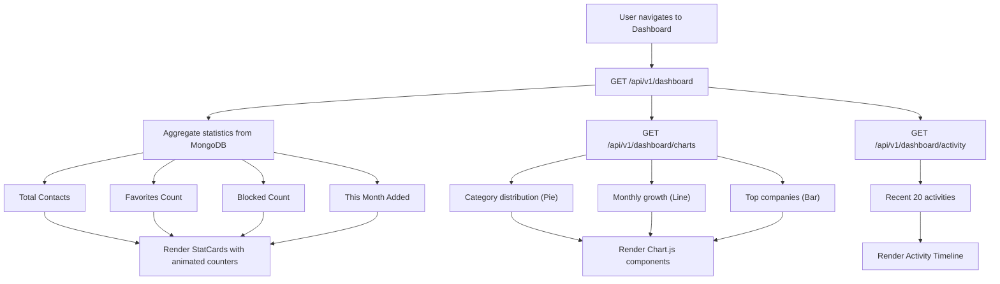

# Application Flowcharts

## Smart Contact Management System — User & System Flows

---

## 1. Main Application Flow

---

## 2. Authentication Flow

---

## 3. Contact CRUD Flow

---

## 4. Search Flow (C++ Trie Engine)

---

## 5. Import/Export Flow

---

## 6. Dashboard Data Flow

