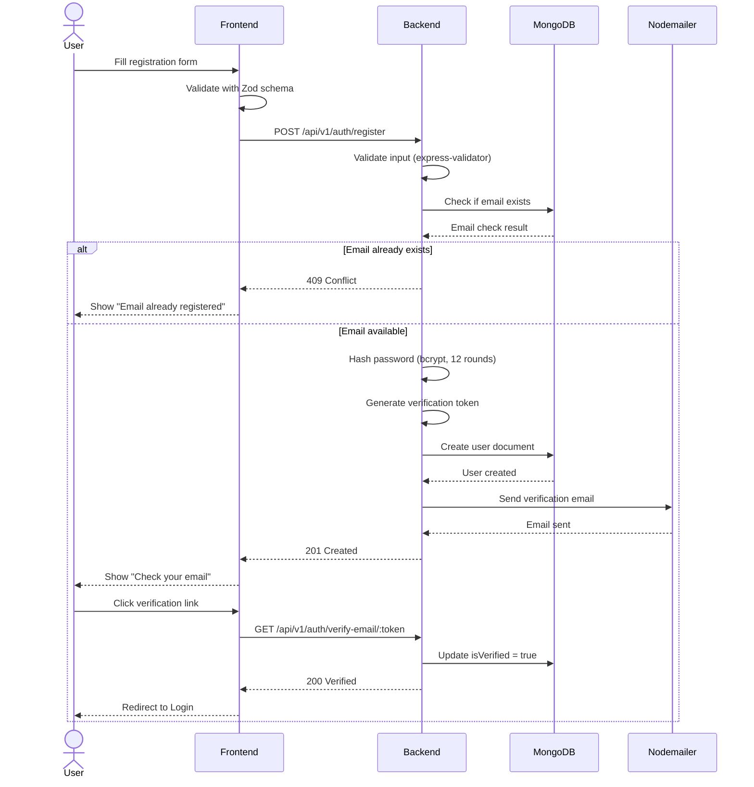
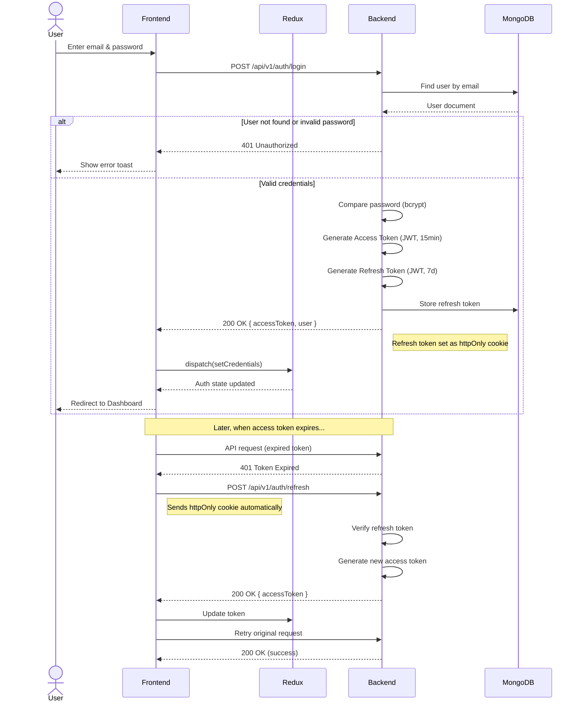
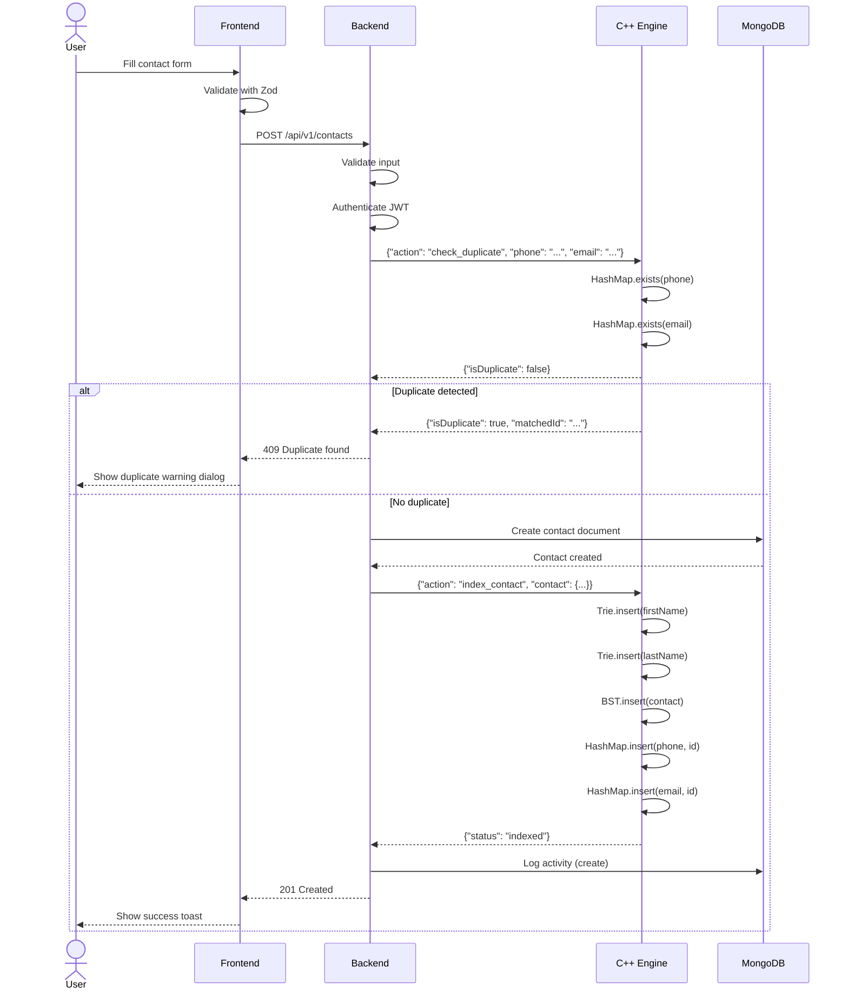
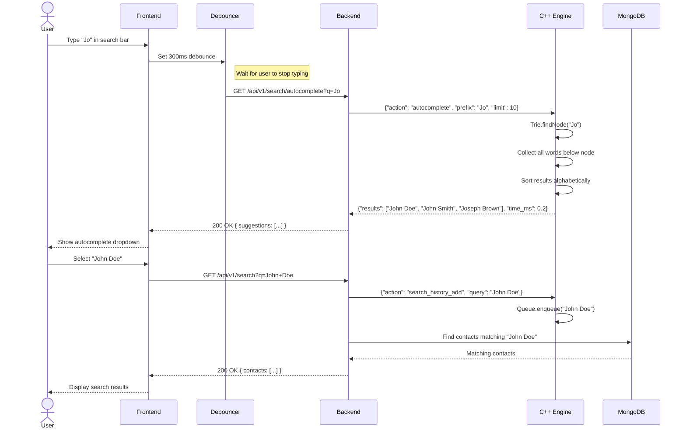
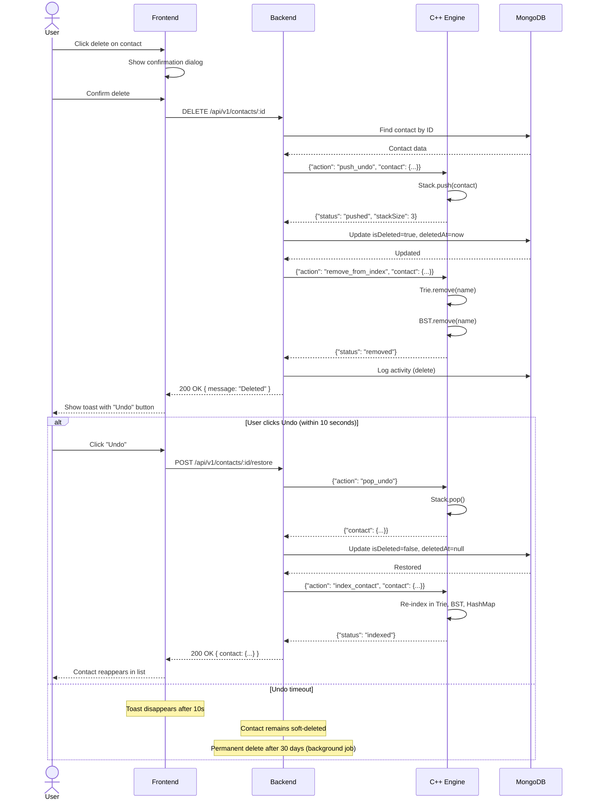
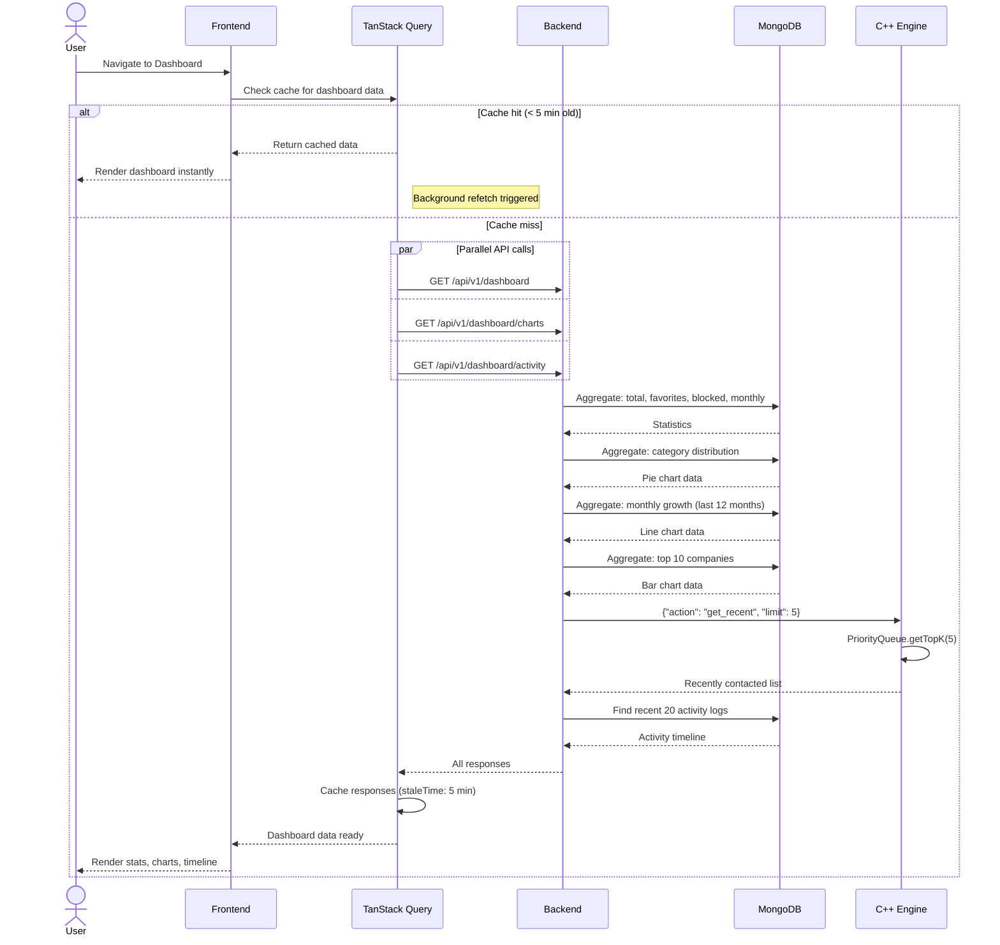

# Sequence Diagrams

## Smart Contact Management System — Key Workflow Sequences

---

## 1. User Registration & Email Verification

---

## 2. Login with JWT Token Flow

---

## 3. Create Contact with Duplicate Detection

---

## 4. Search with C++ Trie Autocomplete

---

## 5. Delete & Undo with C++ Stack

---

## 6. Dashboard Load Sequence

